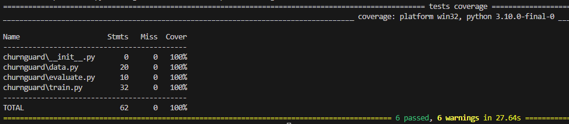
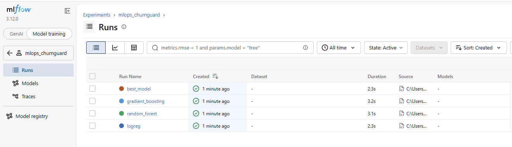
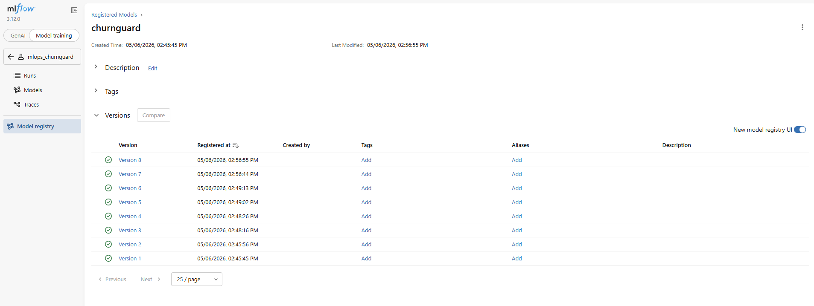

# ChurnGuard MLOps

[](https://github.com/Clement-dbs/Churnguard/actions/workflows/ci.yml)
[](https://github.com/Clement-dbs/Churnguard/actions/workflows/release.yml)
[](https://www.python.org/downloads/release/python-3110/)
[](https://ghcr.io/clement-dbs/churnguard)


> API de prédiction de churn client entraînée sur le dataset Telco Customer Churn,
> déployée via FastAPI + MLflow + Docker avec CI/CD complet sur GitHub Actions.

---

## Stack technique

| Composant    | Technologie                        |
|--------------|------------------------------------|
| ML           | scikit-learn + MLflow              |
| API          | FastAPI + uvicorn                  |
| CI/CD        | GitHub Actions                     |
| Registry     | GitHub Container Registry (ghcr.io)|
| Sécurité     | Trivy (scan CVE)                   |
| Tests        | ruff + mypy + pytest + coverage    |

---

## Structure du projet

```
.
├── api/
│   ├── main.py                 # FastAPI app
│   └── schemas.py              # Pydantic models 
├── churnguard/
│   ├── __init__.py
│   ├── data.py                 # Chargement + preprocessing
│   ├── evaluate.py             # Métriques
│   └── train.py                # Entraînement + MLflow
├── tests/
│   ├── test_data.py
│   └── test_train.py
├── data/
│   └── telco_churn.csv                
├── notebook/
│   └── exploration.ipynb
├── scripts/
│   └── download_data.py        # téléchargement du dataset
├── mlruns/                     
├── Dockerfile                  
├── docker-compose.yml
├── requirements-api.txt
├── pyproject.toml              # config ruff
└── .github/
    └── workflows/
        ├── ci.yml              # lint + typecheck + test 
        └── release.yml         # build
```

---

## Données

**Telco Customer Churn** (IBM Sample Data, ~960 Ko, 7 043 lignes, 21 colonnes).

Le fichier est commité dans le repo. 
Il est également possible de le télécharger :

```bash
python scripts/download_data.py
```

Sources :
- [Kaggle — Telco Customer Churn](https://www.kaggle.com/datasets/blastchar/telco-customer-churn)

---

## Quickstart

### Prérequis

- [Docker](https://docs.docker.com/get-docker/) >= 24
- [Docker Compose](https://docs.docker.com/compose/) >= 2

### Lancer la stack complète

```bash

git clone https://github.com/Clement-dbs/Churnguard.git
cd Churnguard

# 2. Charger le .venv avec les dépendances
python -m venv .venv && source .\.venv\Scripts\activate.ps1 
pip install -r requirements.txt

python -m churnguard.train

# 3. Lancer les services
docker compose up --build
```

### Vérifier que tout est up

```bash
curl http://localhost:8000/health
```

```json
{
  "status": "ok",
  "model": "churnguard",
  "version": "v.*"
}
```

MLflow UI disponible sur [http://localhost:5000](http://localhost:5000).

Swagger UI disponible sur [http://localhost:8000/docs](http://localhost:8000/docs).

---

## Exemple d'appel API

```bash
curl -X POST http://localhost:8000/predict \
  -H "Content-Type: application/json" \
  -d '{
    "gender": "Female",
    "SeniorCitizen": 0,
    "Partner": "Yes",
    "Dependents": "No",
    "tenure": 24,
    "PhoneService": "Yes",
    "MultipleLines": "No",
    "InternetService": "DSL",
    "OnlineSecurity": "Yes",
    "OnlineBackup": "Yes",
    "DeviceProtection": "No",
    "TechSupport": "Yes",
    "StreamingTV": "No",
    "StreamingMovies": "No",
    "Contract": "One year",
    "PaperlessBilling": "Yes",
    "PaymentMethod": "Bank transfer (automatic)",
    "MonthlyCharges": 55.0,
    "TotalCharges": 1320.0
  }'
```

```json
{
  "churn": false,
  "churn_probability": 0.04955112014728018,
  "risk_level": "LOW"
}
```

### Niveaux de risque

| `risk_level` | `churn_probability` | Action recommandée      |
|--------------|---------------------|-------------------------|
| `LOW`        | < 0.3               | Aucune action           |
| `MEDIUM`     | 0.3 – 0.5           | Surveiller le client    |
| `HIGH`       | > 0.5               | Contacter immédiatement |

---


## Développement local

```bash
# Installer les dépendances
pip install -r requirements-api.txt

# Tests
pytest tests/ --cov=churnguard --cov-report=term-missing --cov-fail-under=70

# Lint
ruff check . && ruff format --check .

# Typecheck
mypy churnguard/ api/ --ignore-missing-imports
```

---

## CI/CD

### CI — déclenché sur chaque push et pull request

| Job          | Description                                 |
|--------------|---------------------------------------------|
| `lint`       | ruff check + ruff format --check            |
| `typecheck`  | mypy sur churnguard/ et api/                |
| `test`       | pytest + coverage (seuil 70%)               |
| `build`      | docker build + scan Trivy (CVE CRITICAL)    |

`lint`, `typecheck` et `test` tournent en parallèle. `build` attend les trois.

### CD — déclenché sur push -> tag


1. Build + push image sur `ghcr.io`
2. Scan Trivy post-push (résultats dans l'onglet Security)

---

## Screenshots

### Coverage



### MLflow UI




---
